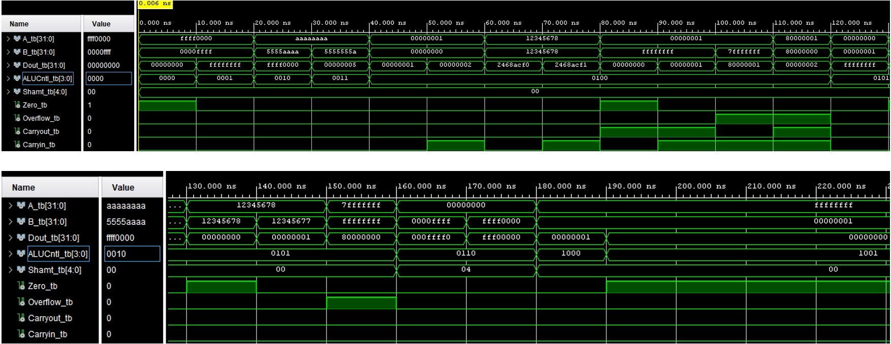

# 32-bit ALU in VHDL

A MIPS-style Arithmetic and Logic Unit (ALU) implemented in VHDL.  

---

## Description
The ALU takes two 32-bit operands and a control signal (`ALUCntl`) to determine the operation.  
It supports logical operations, arithmetic addition and subtraction (with a carry out), shift operations, and set-less-than comparisons.  

Flags are generated to indicate the result of the operation:
- **Zero**: Set if the result equals 0  
- **Carryout**: Set on unsigned addition if a carry out is produced from the operation
- **Overflow**: Set if signed addition or subtraction overflows  

This ALU was used as one of the fundamental building blocks of a MIPS processor datapath.

---

## Features
- 32-bit operands `A` and `B`  
- Supports **AND, OR, XOR, NOR, ADD, SUB, SLL, SRL, SLT, SLTU**  
- Handles signed and unsigned comparisons  
- Carry-in support for addition  
- Outputs flags: **Zero, Carryout, Overflow**  

---

## Simulation Results

### ALU Model

### ALU Operations

### Waveform Output of Testbench
Operations were done every 10ns. Result of operation, including any flags that may have been generated, are shown in the simulated waveform. ALUCntl_tb refers to a desired operation available from the above table of operations.

### Test Vectors Table
Extracted data from simulated waveform.

